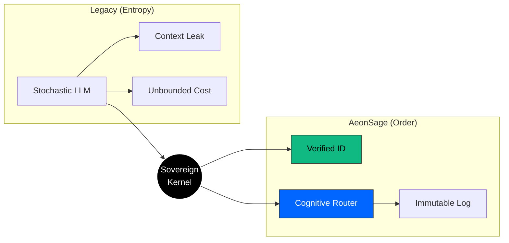

<div align="center">
  <a href="https://aeonsage.org">
    
  </a>
  <br>
  
  [](https://github.com/velonone/Aeonsage/releases)
  [](https://github.com/velonone/Opensage)
  [](./LICENSE)
  [](https://docs.aeonsage.org)
  [](./README_ZH.md)

  <br>
  <p style="font-size: 1.1em; max-width: 800px; margin: auto; padding-top: 20px; color: #666;">
    <b>The Deterministic Sovereign Intelligence Operating System</b><br>
    Start your sovereign journey: <a href="https://aeonsage.org">Official Site</a> • <a href="https://pro.aeonsage.org">Enterprise</a>
  </p>
</div>

<hr style="border: 0; outline: none; height: 1px; background: linear-gradient(to right, transparent, #30363d, transparent); margin: 40px 0;">

## The Sovereign Manifesto

> **"Identity first. Intelligence second. Tooling third."**

In the current landscape of stochastic AI agents, **identity is an afterthought**. Models hallucinate, leak context, and operate without accountability.

**AeonSage** reverses this paradigm. It is an Operating System where **Identity (VDID)** is the kernel-level primitive. Before any cognitive routing occurs, the origin, intent, and permissions of the request are verified against a sovereign ledger.

This is not a chatbot. It is a **Deterministic Runtime Environment** for verified autonomous agency.

---

## Architecture Design

AeonSage implements a strict **Kernel-Ring Architecture**, enforcing separation between the cognitive core and external I/O.

### 2.1 The Sovereign Transformation
AeonSage acts as a **Deterministic Runtime** that stabilizes the entropy of raw LLMs.



### 2.2 Cognitive Execution Sequence
Each user intent is treated as a verifiable transaction.

```mermaid
sequenceDiagram
    participant User
    participant Kernel as Sovereign Kernel
    participant Router as Cognitive Router
    participant Skill as Skill Registry (Ring 2)
    participant Ledger as Audit Log

    User->>Kernel: Submit Intent (Signed)
    Kernel->>Kernel: Verify VDID Signature
    Kernel->>Router: Dispatch Context
    
    rect rgb(20, 20, 20)
        Note over Router: Analysis Phase
        Router->>Router: Evaluates Complexity (0.0 - 1.0)
        
        alt Low Complexity (<0.3)
            Router->>Skill: Execute Local Heuristic
        else High Complexity (>0.7)
            Router->>Skill: Invoke SOTA Model (Claude/GPT-4)
        end
    end

    Skill-->>Router: Result Payload
    Router->>Ledger: Commit Transaction Hash
    Router-->>User: Deterministic Response
```



---

## 4. Connectivity Matrix

The OS provides native protocol bridges, eliminating the need for third-party automation services (like Zapier).

| Protocol | Implementation | Capabilities | Status |
| :--- | :--- | :--- | :---: |
| **WhatsApp** | `wacli` (Baileys) | Multi-device, Media, Voice Notes | ✅ |
| **Telegram** | `MTProto` / Bot API | Secret Chats, Channels, Admin Ops | ✅ |
| **Discord** | WebSocket Gateway | Voice Channels, Slash Commands, Roles | ✅ |
| **Slack** | Enterprise Grid | Threads, File Analysis, App Home | ✅ |
| **Signal** | `libsignal` | E2EE Messaging | ✅ |
| **Email** | SMTP / IMAP | Parsing, Drafting, Attachments | ✅ |

---

## 5. Deployment

### System Requirements
*   **OS**: Windows 11 / macOS 13+ / Linux Kernel 5.15+
*   **Runtime**: Node.js v22.0.0+ (Active LTS)

### Quick Start (Portable)
For Windows users, we provide a zero-dependency portable release.
1.  Download **[AeonSage_OSS.zip](https://github.com/velonone/Aeonsage/releases/latest/download/AeonSage_OSS.zip)**.
2.  Extract the archive.
3.  Run `AeonSage.bat`.

### Developer Install
```bash
# Global installation via NPM
npm install -g aeonsage

# Initialize configuration wizard
aeonsage init

# Launch the kernel
aeonsage start
```

---

## 6. Official Resources

Documentation is structured for system operators and kernel developers.

*   [**Installation Guide**](./docs/install.md)
*   [**Security Policy**](./docs/security.md)
*   [**Kernel Reference**](./docs/sovereign-kernel.md)
*   [**Plugin Development**](./docs/plugin.md)

---

## 7. Ecosystem Partners

Collaborating to build the Sovereign Web.

<table>
  <tr>
    <td align="center" width="33%">
      <a href="https://vdid.org"></a><br>
      <br><b>Identity Layer</b><br>(VDID Network)
    </td>
    <td align="center" width="33%">
      <a href="https://github.com/velonone/Opensage"></a><br>
      <br><b>Cognitive Kernel</b><br>(OpenSage Core)
    </td>
    <td align="center" width="33%">
      <a href="https://velonlabs.com"></a><br>
      <br><b>Research & Engineering</b><br>(VelonLabs)
    </td>
  </tr>
</table>

---

## License & Legal

**AeonSage Community Edition** is distributed under the **MIT License**.

> **Non-Commercial Use Only**: Although the source code is open, the "AeonSage" trademark and the "VDID" verification network are proprietary technologies of VelonLabs. Commercial derivatives utilizing the AEONSAGE brand require an explicit enterprise license.

<div align="center">
  <br>
  <b>Engineered with Precision by</b><br>
  <h3>VelonLabs & The AeonSage Core Team</h3>
  <br>
  
</div>

