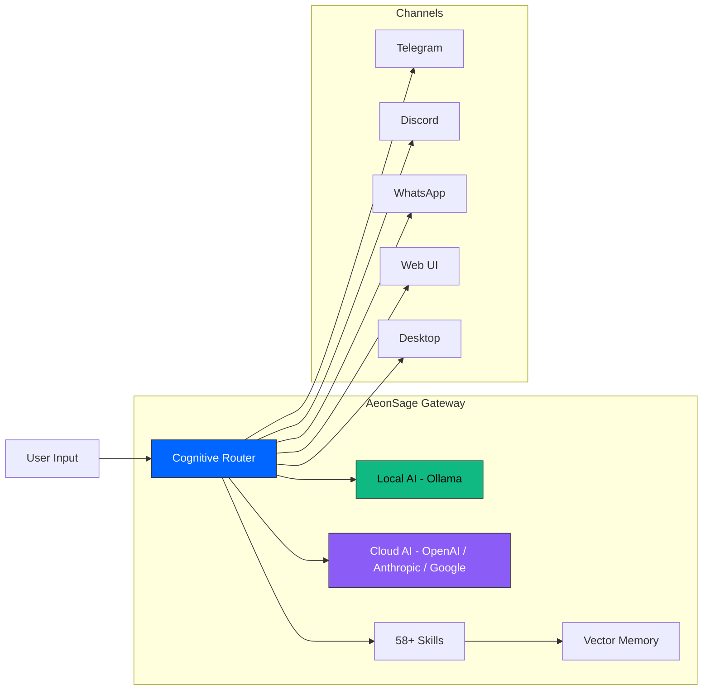

<div align="center">
  <a href="https://aeonsage.org">
    
  </a>

  <br><br>

  **Intelligent. Autonomous. Yours.**<br>
  Build autonomous AI agents with local-first privacy, multi-model routing, and 30+ channel integrations.

  <br>

  [](https://github.com/velonone/Aeonsage/releases)
  [](https://github.com/velonone/Aeonsage)
  [](./LICENSE)
  [](https://aeonsage.org/docs)
  [](./README_ZH.md)

</div>

---

> **Your AI. Your hardware. Your rules.**
>
> AeonSage is a self-hosted AI agent platform that runs entirely on your machine. Connect any AI model — local or cloud — and deploy autonomous agents across 30+ channels. No data leaves your device. No vendor lock-in. Open-source core with an optional Pro tier for cloud features.

---

## Contents

- [Why AeonSage](#why-aeonsage)
- [Core Advantages](#core-advantages)
- [Architecture](#architecture)
- [Platforms](#platforms)
- [Skills](#skills)
- [Connectivity](#connectivity-matrix)
- [Download & Quick Start](#download--quick-start)
- [Editions](#editions)
- [Tech Stack](#tech-stack)
- [For Developers](#for-developers)
- [Ecosystem](#ecosystem-partners)
- [License](#license--legal)

---

## Why AeonSage

Most AI tools are cloud-locked, single-model, and treat your data as their product. AeonSage takes a different approach:

| | Cloud Chatbots | AeonSage |
| :--- | :--- | :--- |
| **Data** | Sent to third-party servers | Never leaves your machine |
| **Models** | Single provider lock-in | Any model — local (Ollama) or cloud (OpenAI, Anthropic, Google) |
| **Channels** | One interface | 30+ native protocol bridges |
| **Cost** | Per-token billing | Unlimited local inference, BYOK for cloud |
| **Extensibility** | Closed ecosystem | Open skill system with MCP support |
| **Deployment** | SaaS only | Self-hosted, air-gapped capable |

---

## Core Advantages

<div align="center">
  <a href="https://github.com/velonone/Opensage">
    
  </a>
</div>

### Cognitive Router — Open-Source Intelligent Model Orchestration

The Cognitive Router is AeonSage's fully open-source decision engine — included in both OSS and Pro editions. Every incoming request is analyzed for complexity, intent type, and domain — then routed to the optimal AI model automatically. Unlike proprietary routing solutions, AeonSage's router is MIT-licensed and runs entirely on your hardware.

> **[Opensage](https://github.com/velonone/Opensage)** — The Cognitive Router is independently open-sourced. The codebase is extremely lightweight and can be integrated into any scenario — including IDEs, CLI tools, bots, and custom applications. PRs are welcome — help us make it better.

**How it works:**

Every request goes through a tiered complexity analysis pipeline. The router classifies intent, evaluates complexity, and selects the most appropriate model — local or cloud — without manual intervention.

```
User Request → Cognitive Router
                  ├── L1 (Simple)  → Local Model (Ollama)
                  ├── L2 (Medium)  → Efficient Cloud Model
                  ├── L3 (Complex) → Premium Model
                  └── Fallback     → Auto-cascade to next provider
```

| Capability | Description |
| :--- | :--- |
| **Tiered Complexity Analysis** | Each request is scored by intent type, domain, and complexity. The router matches the right model to the right task automatically. |
| **Automatic Provider Fallback** | If a model or provider is unavailable, the router cascades to the next available option. No manual switching required. |
| **Semantic Memory** | Context from previous conversations informs routing decisions. The router learns which models work best for your specific use cases over time. |
| **BYOK Support** | Bring Your Own Key for any cloud provider. Use your existing API keys with AeonSage's intelligent routing layer. |
| **Local-First Priority** | When a task can be handled locally, the router prefers the local model — keeping data on your device and reducing external API calls. |

### MCP Tools — Model Context Protocol 

AeonSage implements the **Model Context Protocol (MCP)** as both client and server, enabling your agent to connect to any MCP-compatible tool ecosystem. This feature is currently in **preview** — the API surface may change as the MCP specification evolves.

**As MCP Client** — Your agent can use external MCP servers as tools:
- File systems, databases, APIs, web browsers
- Any third-party MCP server in the ecosystem
- Automatic tool discovery and capability negotiation

**As MCP Server** — Expose AeonSage's 107 RPC methods to external MCP clients:
- Other AI agents can call your AeonSage instance as a tool
- IDE integrations (VS Code, Cursor) can interact with your agent
- Chain multiple AeonSage instances for distributed AI workflows

```typescript
// Example: Using an external MCP tool in a skill
import { defineSkill } from "@aeonsage/sdk";

export default defineSkill({
  name: "research-assistant",
  tools: ["mcp://filesystem", "mcp://web-browser", "mcp://database"],
  async execute(ctx) {
    // Agent automatically discovers and uses available MCP tools
    const files = await ctx.mcp.call("filesystem", "list", { path: "./docs" });
    const summary = await ctx.llm.chat(`Summarize: ${files}`);
    return summary;
  },
});
```

### Multi-Agent Coordination

Spawn specialized worker agents for parallel task execution. Each agent has independent context, memory, and tool access.

- **Supervisor pattern** — One orchestrator agent delegates subtasks to workers
- **Parallel execution** — Multiple agents work simultaneously on different aspects
- **Shared memory** — Agents can read from a shared vector memory space
- **Task handoff** — Seamlessly transfer context between agents

---

## Architecture

AeonSage implements a **six-layer Kernel-Ring Architecture** with 58+ modules and 107 WebSocket RPC methods.

```
                         AeonSage Gateway
  ┌──────────┬──────────┬──────────┬──────────┬─────────────┐
  │  Ring 0  │  Ring 1  │  Ring 2  │  Ring 3  │   Ring 4    │
  │  Kernel  │  Router  │  Skills  │ Channels │  Interface  │
  ├──────────┼──────────┼──────────┼──────────┼─────────────┤
  │ Identity │ Multi-LLM│ 58+ Mods │ 30+ Plat │ Cockpit UI  │
  │ State    │ Tiered   │ MCP SDK  │ Protocol │ Desktop App │
  │ Security │ Fallback │ Plugin   │ Bridges  │ WebSocket   │
  └──────────┴──────────┴──────────┴──────────┴─────────────┘
                     107 RPC Methods
```

### Layer Details

| Layer | Component | What It Does |
| :--- | :--- | :--- |
| **Ring 0 — Kernel** | Sovereign Kernel | Deterministic state machine managing agent lifecycle, VDID identity verification, active defense wall, and immutable audit logging. Every user intent is treated as a verifiable transaction. |
| **Ring 1 — Router** | Cognitive Router | Multi-model orchestration with tiered complexity analysis. Routes each request to the optimal model (local Ollama, OpenAI, Anthropic, Google, etc.) with automatic provider fallback cascade and semantic memory. Saves tokens by matching model power to task complexity. |
| **Ring 2 — Skills** | Skill Extensions | 58+ built-in modules covering browser automation, voice wake, DeFi monitoring, cron scheduling, vector memory, and multi-agent coordination. Extensible via MCP protocol and Plugin SDK. |
| **Ring 3 — Channels** | Channel Bridges | 30+ native protocol bridges. WhatsApp, Telegram, Discord, Slack, Signal, Email, LINE, Matrix, WeChat, and more. Each bridge implements the native protocol — no third-party automation middleware. |
| **Ring 4 — Interface** | Interface Layer | Lit 3.3 Cockpit web UI for real-time monitoring, Tauri v2 Desktop client for daily use, and 107 WebSocket RPC methods for programmatic access. |

### How It Works



---

## Platforms

### Three-in-One Experience

AeonSage unifies **Website + Desktop + Channels** into a single seamless experience. Register on the website, download the desktop app, and all local deployment features are ready — one gateway instance powers everything with continuous context across all surfaces.

```
  ┌─────────────┐     ┌──────────────┐     ┌──────────────┐
  │   Website   │     │   Desktop    │     │   Channels   │
  │  Register   │ ──→ │  Download    │ ──→ │  30+ Bridges │
  │  Dashboard  │     │  Local AI    │     │  Zero Config │
  └─────────────┘     └──────────────┘     └──────────────┘
         │                    │                     │
         └────────────────────┼─────────────────────┘
                              │
                    ┌─────────┴─────────┐
                    │  AeonSage Gateway │
                    │  One Instance     │
                    │  Shared Context   │
                    └───────────────────┘
```

### Desktop Client

Built with **Tauri v2** (Rust) + **React 19** — native performance at ~10 MB (vs ~150 MB for Electron).

- **Chat** — Multi-agent tabs with independent context per conversation
- **Workflow** — Visual drag-and-drop multi-agent workflow builder
- **Skills** — One-click skill marketplace with install, configure, and manage
- **Settings** — Model configuration, BYOK key management, theme customization
- **Agent Visualization** — Real-time execution flow, tool calls, and reasoning traces
- **Cross-Platform** — Windows, macOS, Linux

### Web Dashboard

Your command center at `aeonsage.org/dashboard`. Agent configuration, skill market, analytics, and billing — manage everything from the browser.

### Channels

Zero-install entry points. Send a message to your agent on Telegram, Discord, WhatsApp, or any of the 30+ supported channels. Continuous context across every surface.

---

## Skills

Browse 30+ pre-built skills or create your own. Each skill extends your agent with new capabilities.

| Skill | Description |
| :--- | :--- |
| **Browser Automation** | Automate web research with Playwright. Your agent browses, scrapes, and reports back. |
| **Voice Wake** | "Hey AeonSage" — hands-free control with TTS/STT powered voice interface. |
| **DeFi Monitor** | Track on-chain flows, whale alerts, and portfolio in real-time. |
| **Cron Tasks** | Schedule recurring tasks — morning briefings, daily reports, price checks. |
| **Vector Memory** | Semantic search across conversation history. Persistent context across sessions. |
| **Multi-Agent** | Spawn worker agents for parallel tasks. Scale your team with autonomous workers. |
| **MCP Tools** | Model Context Protocol support. Connect to external tools and data sources. AeonSage acts as both MCP client and server. |
| **VDID Identity** | Verifiable decentralized identity with on-chain reputation score. |

> Build custom skills with TypeScript and publish to the Skill Market. Full access to the Gateway's 107 RPC methods.

---

## Connectivity Matrix

Native protocol bridges — no third-party automation required.

| Protocol | Implementation | Capabilities | Status |
| :--- | :--- | :--- | :---: |
| **Telegram** | MTProto / Bot API | Secret Chats, Channels, Groups, Admin Ops, Bot Commands |  |
| **WhatsApp** | Baileys (wacli) | Multi-device, Media, Voice Notes, Group Chat |  |
| **Discord** | WebSocket Gateway | Voice Channels, Slash Commands, Roles, Reactions |  |
| **Slack** | Enterprise Grid | Threads, File Analysis, App Home, Workflows |  |
| **Signal** | libsignal | E2EE Messaging, Group Chat |  |
| **Email** | SMTP / IMAP | Parsing, Drafting, Attachments, Threading |  |
| **LINE** | Messaging API | Rich Menus, Flex Messages |  |
| **Matrix** | matrix-js-sdk | Federation, E2EE Rooms |  |
| **WeChat** | itchat / WxPusher | Text, Media, Mini Programs |  |
| **Nostr** | NIP-01 WebSocket | Decentralized Relay Messaging |  |

> **30+ channels** supported in total including Mattermost, Google Chat, Twitch, Feishu, MS Teams, and more. See the [full list](https://aeonsage.org/docs).

---

## Download & Quick Start

### Download

| Platform | Download | Requirements |
| :--- | :--- | :--- |
| **Windows** | [AeonSage-win.exe](https://aeonsage.org/download) | Windows 10+ |
| **macOS** | Coming Soon | macOS 13+, Apple Silicon & Intel |
| **Linux** | [AeonSage-linux.AppImage](https://aeonsage.org/download) | Ubuntu 22+ / Fedora 38+ |

### Portable (Windows)

```bash
# Download and extract
curl -LO https://github.com/velonone/Aeonsage/releases/latest/download/AeonSage_OSS.zip
# Extract and run AeonSage.bat
```

### Developer Install

```bash
# Clone the repository
git clone https://github.com/velonone/Aeonsage.git
cd Aeonsage

# Install dependencies (requires pnpm)
pnpm install

# Initialize configuration
pnpm run init

# Launch the gateway
pnpm start
```

The Cockpit UI will be available at `http://localhost:18789`.

### With Ollama (Local AI)

```bash
# Install Ollama (https://ollama.com)
ollama pull llama3.1

# Start AeonSage with Ollama auto-detection
pnpm start
# AeonSage will automatically detect and connect to your local Ollama instance
```

### Docker

```bash
docker compose -f docker-compose.prod.yml up -d
```

---

## Editions

AeonSage follows an **OSS Open-Source + Pro Commercial** dual-track model. The open-source edition is fully functional for local AI. Pro unlocks cloud capabilities and advanced features.

| | Free (OSS) | Pro | Enterprise |
| :--- | :---: | :---: | :---: |
| **Price** | $0 | $59/mo | Custom |
| **Model** | Open-Source (MIT) | Commercial License | Commercial License |
| **Deployment** | Self-hosted | Self-hosted + Cloud | Private Cloud / On-Premise |
| **Target Users** | Developers, Self-hosters | Power Users, Creators | Teams, Organizations, Industry-Specific |
| **Local AI (Ollama)** |  |  |  |
| **Cognitive Router** |  |  |  |
| **All 30+ Channels** |  |  |  |
| **MCP Tools (Client + Server)** |  |  |  |
| **BYOK (Bring Your Own Key)** |  |  |  |
| **Voice Wake + TTS** |  |  |  |
| **Browser Automation** |  |  |  |
| **Community Skills** |  |  |  |
| **Desktop Client** |  |  |  |
| **Cloud AI (Unlimited)** |  |  |  |
| **Telegram Bot Remote** |  |  |  |
| **CloudRelay** |  |  |  |
| **Finance + DeFi Trading** |  |  |  |
| **VDID On-chain Identity** |  |  |  |
| **Premium AI Models** |  |  |  |
| **Pro Themes + Workers** |  |  |  |
| **Private Cloud Deploy** |  |  |  |
| **Team Management + API** |  |  |  |
| **Industry Customization** |  |  |  |
| **SOC2, SAML/SCIM, Audit** |  |  |  |

> **Free edition is fully functional for local AI.** Unlimited Ollama inference, all 30+ channels, **open-source Cognitive Router** (intelligent model orchestration), MCP tools (client + server), BYOK cloud access, voice wake, browser automation, and community skills — all at $0. Pro unlocks unlimited cloud AI, Telegram bot remote control, finance panel, and premium models. **Enterprise is the highest tier** — custom deployments tailored to specific industry verticals (finance, healthcare, legal, etc.) with dedicated support, compliance, and team management.

---

## Tech Stack

| Component | Technology | Purpose |
| :--- | :--- | :--- |
| **Runtime** | Node.js 22+ (ESM) | Gateway server and skill execution |
| **Language** | TypeScript 5.x | End-to-end type safety |
| **Backend** | Hono + Express + WebSocket | HTTP API, static serving, real-time RPC |
| **Cockpit UI** | Lit 3.3 + Vite 7 | Web-based monitoring and control panel |
| **Desktop** | Tauri v2 (Rust) + React 19 | Native desktop client (~10 MB) |
| **Website** | React 19 + Vite | Marketing site and documentation |
| **Auth** | Social Login (Telegram / Google / GitHub) | Stage-based: anonymous → social → wallet |
| **Database** | PostgreSQL + SQLite (local) | Cloud persistence + local state |
| **AI Local** | Ollama | Local model inference (Llama, Mistral, etc.) |
| **AI Cloud** | OpenRouter, Anthropic, OpenAI, Google | Cloud model access with BYOK support |
| **MCP** | Model Context Protocol | Client + Server for external tool integration |
| **Identity** | VDID Network | Verifiable decentralized identity (Pro) |

---

## For Developers

### OpenAI-Compatible API

AeonSage exposes an OpenAI-compatible HTTP API. Use any OpenAI client library with your local instance:

```bash
curl http://localhost:18789/v1/chat/completions \
  -H "Content-Type: application/json" \
  -d '{
    "model": "llama3.1",
    "messages": [{"role": "user", "content": "Hello"}]
  }'
```

### Building Skills

Skills are TypeScript modules that extend agent capabilities. Full access to the Gateway's 107 RPC methods:

```typescript
import { defineSkill } from "@aeonsage/sdk";

export default defineSkill({
  name: "my-skill",
  description: "A custom skill",
  async execute(ctx) {
    const result = await ctx.llm.chat("Summarize this document");
    return result;
  },
});
```

### MCP Integration

AeonSage implements the full MCP specification. Connect external tools as MCP servers, or expose your AeonSage instance as an MCP server for other clients:

```typescript
// Register an external MCP server
await gateway.mcp.register({
  name: "my-database",
  transport: "stdio",
  command: "npx",
  args: ["-y", "@modelcontextprotocol/server-sqlite", "data.db"],
});

// Now agents can use the database as a tool
const result = await agent.chat("Show me all users from the database");
```

### WebSocket RPC

107 methods for programmatic control:

```typescript
const ws = new WebSocket("ws://localhost:18789/ws");
ws.send(JSON.stringify({
  method: "agent.send",
  params: { channel: "telegram", message: "Hello from API" }
}));
```

> Full API reference at [aeonsage.org/docs](https://aeonsage.org/docs).

---

## Ecosystem Partners

<table>
  <tr>
    <td align="center" width="33%">
      <a href="https://github.com/velonone/Opensage"></a><br>
      <br><b>Cognitive Router</b><br>Opensage — Open-Source Intelligent Model Orchestration
    </td>
    <td align="center" width="33%">
      <a href="https://vdid.org"></a><br>
      <br><b>Identity Layer</b><br>VDID Network — Verifiable Decentralized Identity
    </td>
    <td align="center" width="33%">
      <a href="https://velonlabs.com"></a><br>
      <br><b>Research & Engineering</b><br>VelonLabs — Part of the Velon Ecosystem
    </td>
  </tr>
</table>

---

## License & Legal

**AeonSage Community Edition** is distributed under the **MIT License** with a trademark addendum.

- **Source code** — MIT License. Fork, modify, and self-host freely.
- **Brand assets** — The "AeonSage" name, logo, and "VDID" verification network are proprietary assets of VelonLabs. Commercial derivatives utilizing the AeonSage brand require an explicit enterprise license.
- **Open-source core. Self-hosted or cloud. Privacy-first.**

---

<div align="center">

  

  <br><br>

  **Engineered by [VelonLabs](https://velonlabs.com) & The AeonSage Core Team**

  <br>

  [](https://aeonsage.org)
  [](https://aeonsage.org/download)
  [](https://aeonsage.org/docs)
  [](https://t.me/aeonsage)
  [](https://x.com/AeonSage)

  <br>

  <sub>Copyright &copy; 2025-2026 VelonLabs. All rights reserved.</sub>

</div>
