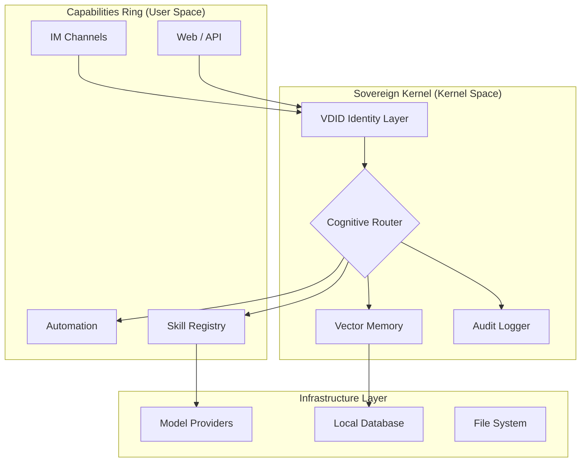

<div align="center">
  <a href="https://aeonsage.org">
    
  </a>
  <br>
  
  [](https://github.com/velonone/Aeonsage/releases)
  [](https://github.com/velonone/Opensage)
  [](./LICENSE)
  [](https://github.com/velonone/Aeonsage/actions)
  [](https://docs.aeonsage.org)

  <br>
  <p style="font-size: 1.1em; max-width: 800px; margin: auto; padding-top: 20px; color: #666;">
    <b>The Deterministic Sovereign Intelligence Operating System</b><br>
    Engineered by <a href="https://velonlabs.com"><b>VelonLabs</b></a> & <a href="https://aeonsage.org"><b>AeonSage Team</b></a>
  </p>
</div>

<hr style="border: 0; outline: none; height: 2px; background: linear-gradient(to right, transparent, #30363d, transparent); margin: 40px 0;">

## 1. Introduction: The Sovereign Narrative

**AeonSage is not a chatbot; it is a Kernel.**

In an era of probabilistic AI models that hallucinate and leak data, AeonSage introduces a **Sovereign Operating System** paradigm. It wraps stochastic LLMs in a deterministic runtime environment, enforcing **Identity Verification (VDID)**, **Cognitive Routing**, and **Operational Security** by design.

> **Open Source Core**: The cognitive engine is open-sourced as [**OpenSage**](https://github.com/velonone/Opensage), providing a transparent foundation for sovereign identity.

Unlike generic agent frameworks, AeonSage is architected for **Institutional Grade Agency**—where every action is validated, recorded, and attributable to a specific sovereign identity.

---

## 2. System Architecture

AeonSage operates on a "Ring Architecture" similar to traditional OS kernels, ensuring isolation between the cognitive core and external capability IO.



---

## 3. Deployment Requirements

Before deploying the AeonSage OS, ensure your environment meets the minimum specifications.

### **System Requirements**
| Component | Minimum Spec | Recommended |
| :--- | :--- | :--- |
| **OS** | Windows 10/11, macOS 12+, Linux (Debian/Ubuntu) | Linux Kernel 5.15+ / Windows 11 |
| **Runtime** | **Node.js v22.0.0+** | **Node.js v22.13.0 (LTS)** |
| **Memory** | 4 GB RAM | 16 GB+ (for local models) |
| **Storage** | 10 GB SSD | NVMe SSD |

### **Installation Strategy**

#### **Option A: Portable Binary (Windows)**
Valid for non-technical users or rapid deployment.
1. Download the verified **[AeonSage_OSS.zip](https://github.com/velonone/Aeonsage/releases/latest/download/AeonSage_OSS.zip)**.
2. Extract to a secure directory (e.g., `C:\AeonSage`).
3. Execute `AeonSage.bat` to initialize the kernel.

#### **Option B: Corepack Installation (Global)**
Standard deployment for developers.
```bash
# 1. Install via NPM Registry
npm install -g aeonsage

# 2. Initialize System Configuration
aeonsage init

# 3. Start the Kernel
aeonsage start
```

---

## 4. Feature Matrix & Edition Comparison

AeonSage implies a hierarchy of capability. The **Community OS** provides complete sovereignty for individuals, while the **Professional OS** enables institutional scale.

| **Capability Layer** | **Feature** | **Community OS (OSS)** | **Professional OS (PRO)** |
| :--- | :--- | :---: | :---: |
| **Identity** | **VDID Verification** | Local / Self-Signed | **Global Consensus** |
| | **Session Binding** | Single User | **Multi-Tenant / SSO** |
| **Cognition** | **Inference Engine** | Local Router | **Nexus Cluster** |
| | **Skills Access** | Standard Library (50+) | **Proprietary Financial/Legal** |
| **Security** | **Active Defense** | Standard Ruleset | **Heuristic Zero-Day Wall** |
| | **Audit Logs** | JSON / SQLite | **Immutable Ledger (WORM)** |
| **Connectivity** | **Channels** | 20+ Platforms | **Carrier-Grade Telephony** |
| | **Rate Limits** | Standard | **Unlimited / Dedicated** |
| **Support** | **SLA** | Community | **24/7 Enterprise** |

---

## 5. Ecosystem Capabilities

AeonSage enables a "Universal Interface" to the digital world.

### **🌐 Omni-Channel Connectivity**
The OS natively speaks 20+ protocols across the web hierarchy.
<table>
  <tr>
    <td align="center"><b>Instant Messaging</b></td>
    <td align="center"><b>Enterprise</b></td>
    <td align="center"><b>Decentralized</b></td>
    <td align="center"><b>Social</b></td>
  </tr>
  <tr>
    <td>WhatsApp • Telegram • Signal<br>iMessage • Line • Zalo</td>
    <td>Slack • Discord • Teams<br>Google Chat • Zoom</td>
    <td>Matrix • Nostr • XMMP<br>IRC</td>
    <td>Twitter • Twitch • Reddit<br>YouTube</td>
  </tr>
</table>

### **🧩 Deterministic Skills**
A registry of verified executables that the agent can invoke safely.
*   **DevOps**: GitHub, Docker, Kubernetes, Tmux, 1Password.
*   **Productivity**: Notion, Trello, Obsidian, Google Workspace.
*   **Lifestyle**: Spotify, Uber, Weather, Home Assistant (OpenHue).
*   **Research**: Perplexity, Google Search, Wolfram Alpha.

---

## 6. Documentation Index

Information architecture for developers and operators.

### **📘 Start Here**
*   [**Installation Guide**](./docs/install.md): Detailed environment setup.
*   [**QUICKSTART**](./docs/QUICKSTART.md): Zero to One in 5 minutes.
*   [**Configuration**](./docs/wizard.md): Managing `config.yaml` and secrets.

### **🛡️ Security & Operations**
*   [**Security Policy**](./docs/security.md): Hardening guide for public instances.
*   [**Logging Standards**](./docs/logging.md): Understanding audit trails.
*   [**Remote Gateway**](./docs/remote-access.md): Secure tunnel configuration.

### **💻 Developer Reference**
*   [**CLI Reference**](./docs/cli/README.md): Complete command list.
*   [**Plugin SDK**](./docs/plugin.md): Building custom skills.
*   [**Testing Framework**](./docs/testing.md): Validating agent behavior.

---

## 7. Ecosystem Partners

We collaborate with industry leaders to define the standard for Sovereign Intelligence.

<table>
  <tr>
    <td align="center" width="25%">
      <br>
      <br><b>Identity Layer</b><br>Verifiable Decentralized ID
    </td>
    <td align="center" width="25%">
      <br>
      <br><b>Cognitive Kernel</b><br>Reasoning Router
    </td>
    <td align="center" width="25%">
      <br>
      <br><b>Research Lab</b><br>Sovereign Architecture
    </td>
    <td align="center" width="25%">
      <br>
      <br><b>VelonLabs</b><br>System Engineering
    </td>
  </tr>
</table>

---

## ⚠️ License & Usage

**AeonSage Community Edition** is licensed under the **MIT License**.

> **Non-Commercial Note**: While the source code is open, the "AeonSage" trademark and the "VDID" verification network are proprietary technologies of VelonLabs. Commercial derivatives utilizing the AEONSAGE brand require an explicit enterprise license.

<div align="center">
  <br>
  <b>Engineered with Precision by</b><br>
  <h3>VelonLabs & The AeonSage Core Team</h3>
  <br>
  
</div>
