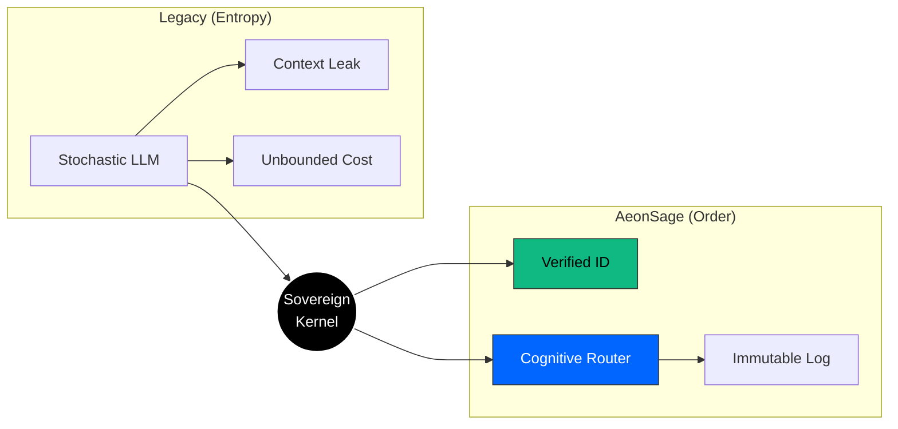

<div align="center">
  <a href="https://aeonsage.org">
    
  </a>
  <br>

  [](https://github.com/velonone/Aeonsage/releases)
  [](https://github.com/velonone/Aeonsage)
  [](./LICENSE)
  [](https://docs.aeonsage.org)
  [](./README_ZH.md)

  <br>
  <p style="font-size: 1.1em; max-width: 800px; margin: auto; padding-top: 20px; color: #666;">
    <b>The Deterministic Sovereign Intelligence Operating System</b><br>
    Start your sovereign journey: <a href="https://aeonsage.org">Official Site</a> • <a href="https://pro.aeonsage.org">Enterprise</a>
  </p>
</div>

<hr style="border: 0; outline: none; height: 1px; background: linear-gradient(to right, transparent, #30363d, transparent); margin: 40px 0;">

## The Sovereign Manifesto

> **"Identity first. Intelligence second. Tooling third."**

In the current landscape of stochastic AI agents, **identity is an afterthought**. Models hallucinate, leak context, and operate without accountability.

**AeonSage** reverses this paradigm. It is an Operating System where **Identity (VDID)** is the kernel-level primitive. Before any cognitive routing occurs, the origin, intent, and permissions of the request are verified against a sovereign ledger.

This is not a chatbot. It is a **Deterministic Runtime Environment** for verified autonomous agency.

---

## Architecture

AeonSage implements a strict **Kernel-Ring Architecture**, enforcing separation between the cognitive core and external I/O.

### Sovereign Transformation



### Cognitive Execution Sequence
Each user intent is treated as a verifiable transaction.

```mermaid
sequenceDiagram
    participant User
    participant Kernel as Sovereign Kernel
    participant Router as Cognitive Router
    participant Skill as Skill Registry (Ring 2)
    participant Ledger as Audit Log

    User->>Kernel: Submit Intent (Signed)
    Kernel->>Kernel: Verify VDID Signature
    Kernel->>Router: Dispatch Context
    
    rect rgb(20, 20, 20)
        Note over Router: Analysis Phase
        Router->>Router: Evaluates Complexity (0.0 - 1.0)
        
        alt Low Complexity (<0.3)
            Router->>Skill: Execute Local Heuristic
        else High Complexity (>0.7)
            Router->>Skill: Invoke SOTA Model (Claude/GPT-4)
        end
    end

    Skill-->>Router: Result Payload
    Router->>Ledger: Commit Transaction Hash
    Router-->>User: Deterministic Response
```



### Core Capabilities

**Ring 0 — Sovereign Kernel**
*   **Deterministic State Machine**: Manages lifecycle, memory context, and permission boundaries.
*   **Active Defense Wall**: Heuristic security layer intercepting prompt injection and jailbreak attempts.
*   **Audit Logger**: Immutable recording of every high-stakes decision.

**Ring 1 — Cognitive Router**
*   **Multi-LLM Routing**: Analyzes prompt complexity and routes to optimal model (local/cloud).
*   **Tiered Selection**: Reflex (fast/cheap) → Standard → Deep (reasoning).
*   **Provider Fallback**: Automatic cascade across OpenRouter, Groq, OpenAI, Anthropic, Google.

**Ring 2 — Skill Extensions**
*   **54+ Built-in Skills**: Code execution, file management, web scraping, media processing, and more.
*   **Plugin SDK**: Extend with custom skills via the plugin development interface.

---

## Connectivity Matrix

Native protocol bridges — no third-party automation required.

| Protocol | Implementation | Capabilities | Status |
| :--- | :--- | :--- | :---: |
| **WhatsApp** | `wacli` (Baileys) | Multi-device, Media, Voice Notes | ✅ |
| **Telegram** | `MTProto` / Bot API | Secret Chats, Channels, Admin Ops | ✅ |
| **Discord** | WebSocket Gateway | Voice Channels, Slash Commands, Roles | ✅ |
| **Slack** | Enterprise Grid | Threads, File Analysis, App Home | ✅ |
| **Signal** | `libsignal` | E2EE Messaging | ✅ |
| **Email** | SMTP / IMAP | Parsing, Drafting, Attachments | ✅ |

---

## Deployment Guide

### System Requirements
*   **OS**: Windows 11 / macOS 13+ / Linux Kernel 5.15+
*   **Runtime**: Node.js v22.0.0+ (Active LTS)

### Quick Start (Portable)
For Windows users, we provide a zero-dependency portable release.
1.  Download **[AeonSage_OSS.zip](https://github.com/velonone/Aeonsage/releases/latest/download/AeonSage_OSS.zip)**.
2.  Extract the archive.
3.  Run `AeonSage.bat`.

### Developer Install
```bash
# Global installation via NPM
npm install -g aeonsage

# Initialize configuration wizard
aeonsage init

# Launch the kernel
aeonsage start
```

### Edition Comparison

AeonSage is available in two editions. The **Community Edition** is fully functional and open source.
The **Professional Edition** unlocks enterprise-grade capabilities for teams and production workloads.

| Category | Community | Professional |
| :--- | :---: | :---: |
| **Cognitive Engine** |  |  |
| **Multi-LLM Routing** |  |  |
| **Identity (VDID)** |  |  |
| **Messaging Channels** |  |  |
| **Skill Extensions** |  |  |
| **Active Defense** |  |  |
| **Encrypted Vault** |  |  |
| **Audit & Compliance** |  |  |
| **Control Dashboard** |  |  |
| **Workflow Builder** |  |  |
| **Multi-Agent** |  |  |
| **Self-Hosted** |  |  |
| **Managed Cloud** |  |  |
| **Priority Support** |  |  |

> **Interested in the Professional Edition?** → [pro.aeonsage.org](https://pro.aeonsage.org)

---

## Ecosystem Partners

<table>
  <tr>
    <td align="center" width="50%">
      <a href="https://vdid.org"></a><br>
      <br><b>Identity Layer</b><br>(VDID Network)
    </td>
    <td align="center" width="50%">
      <a href="https://velonlabs.com"></a><br>
      <br><b>Research & Engineering</b><br>(VelonLabs)
    </td>
  </tr>
</table>

---

## License & Legal

**AeonSage Community Edition** is distributed under the **MIT License**.

> **Non-Commercial Use Only**: Although the source code is open, the "AeonSage" trademark and the "VDID" verification network are proprietary technologies of VelonLabs. Commercial derivatives utilizing the AEONSAGE brand require an explicit enterprise license.

<div align="center">
  <br>
  <b>Engineered with Precision by</b><br>
  <h3>VelonLabs & The AeonSage Core Team</h3>
  <br>
  
</div>
