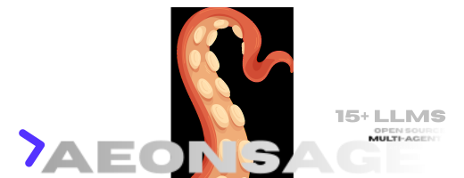
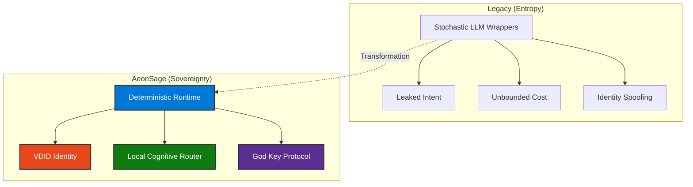
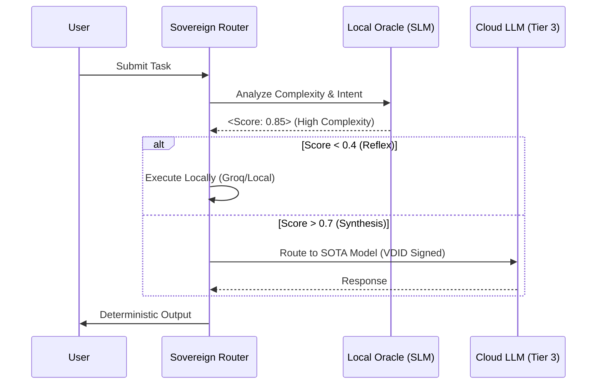
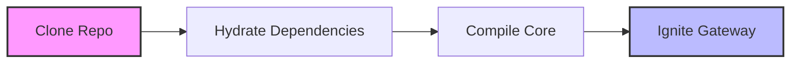
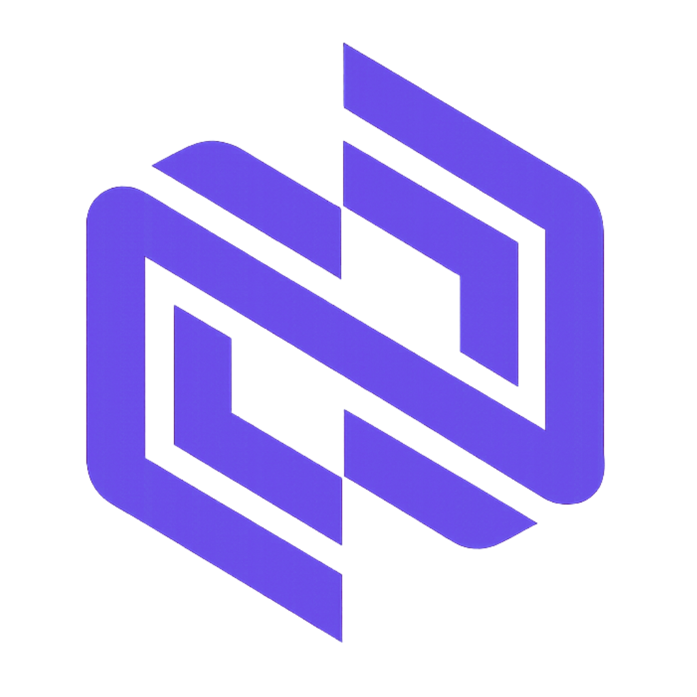

<div align="center">



**The Deterministic Foundation for Autonomous Agency**

**A Joint Release by VelonLabs & @Aeonsage**

<p>
  <a href="https://aeonsage.org">Official Site</a> •
  <a href="https://docs.aeonsage.org">Technical Documentation</a> •
  <a href="https://pro.aeonsage.org">Enterprise Solutions</a>
</p>

<p align="center">
  <a href="https://github.com/velonone/AeonsagePro/releases/latest">
    
  </a>
  <a href="https://github.com/velonone/AeonsagePro/releases/latest">
    
  </a>
</p>

<p align="center">
  
  
  <a href="./LICENSE"></a>
  <a href="./docs/security.md"></a>
  <a href="./README_ZH.md"></a>
</p>

</div>

---

## 1. The Sovereign Thesis

**AeonSage** is a **Layer-2 Cognitive Fabric** engineered to solve the entropy problem of autonomous agents. Unlike stochastic "chatbot" frameworks, AeonSage provides a **Deterministic Runtime Environment** rooted in three axioms: **Identity**, **Security**, and **Economics**.



---

## 2. Architectural Specifications

### 2.1 The Cognitive Kernel (OpenSage)

The **Sovereign Cognitive Router** acts as a local-first decision engine, evaluating task complexity before routing. This architecture ensures zero telemetry for sensitive internal reasoning.



### 2.2 Defense-in-Depth Protocols

| Component | Mechanism | Objective |
| :--- | :--- | :--- |
| **The God Key** | WebSocket Kill Switch | < 50ms Global Process Termination |
| **VDID** | `did:vdid` Cryptographic Signatures | Non-Repudiation & Forensic Audit |
| **Air-Gap Mode** | Local Vector Store (ChromaDB) | Zero-Telemetry Operations |

---

## 3. Cognitive Economics

**Optimistic Cascading Logic** drastically reduces operational overhead by routing tasks to the most efficient tier.

| Cognitive Tier | Model Class | Cost Basis | Utilization Target |
| :--- | :--- | :--- | :--- |
| **Tier 1 (Reflex)** | Local SLM / Groq | **~$0.05 / 1M** | 60% of Traffic |
| **Tier 2 (Reasoning)** | GPT-4o-mini | ~$0.15 / 1M | 30% of Traffic |
| **Tier 3 (Synthesis)** | Claude 3.5 / o1 | ~$15.00 / 1M | 10% of Traffic |

---

## 4. Integration Standards

The **Channel Abstraction Layer** unifies state management across heterogeneous networks.

| Network Protocol | Integration Method | Security Context |
| :--- | :--- | :--- |
| **Telegram** | MTProto Wrapper | VDID-Signed Payloads |
| **Discord** | OAuth2 Gateway | Role-Based Access Control (RBAC) |
| **WhatsApp** | Baileys (WebSocket) | End-to-End Encryption Preserved |
| **Signal** | Libsignal Client | Local Decryption Only |
| **Terminal** | TUI Dashboard | Root / Sudo Context |

---

## 5. Deployment Protocol

### Initialization Sequence



```bash
# 1. Clone Sovereign Repository
git clone https://github.com/velonone/AeonsagePro.git

# 2. Hydrate Dependencies
corepack enable && pnpm install

# 3. Compile Core
pnpm build

# 4. Ignite Gateway
pnpm aeonsage gateway
```

---

## 6. Strategic Ecosystem

AeonSage is the convergence of high-integrity sovereign technologies.

<table align="center" border="0" cellpadding="10">
  <tr>
    <td align="center" width="33%">
      <a href="https://vdid.io">
        
      </a>
      <br><br>
      <strong>Identity Layer</strong>
      <br>
      <sub>Verifiable Decentralized ID</sub>
    </td>
    <td align="center" width="33%">
      <a href="https://github.com/velonone/Opensage">
        
      </a>
      <br><br>
      <strong>Cognitive Kernel</strong>
      <br>
      <sub>Local-First Reasoning Router</sub>
    </td>
    <td align="center" width="33%">
      <a href="https://velonlabs.com">
        
      </a>
      <br><br>
      <strong>Research Lab</strong>
      <br>
      <sub>Sovereign Architecture</sub>
    </td>
  </tr>
</table>

---

<div align="center">
  <sub><strong>EST. 2025 · AEONSAGE COLLECTIVE · MIT LICENSE</strong></sub>
</div>
