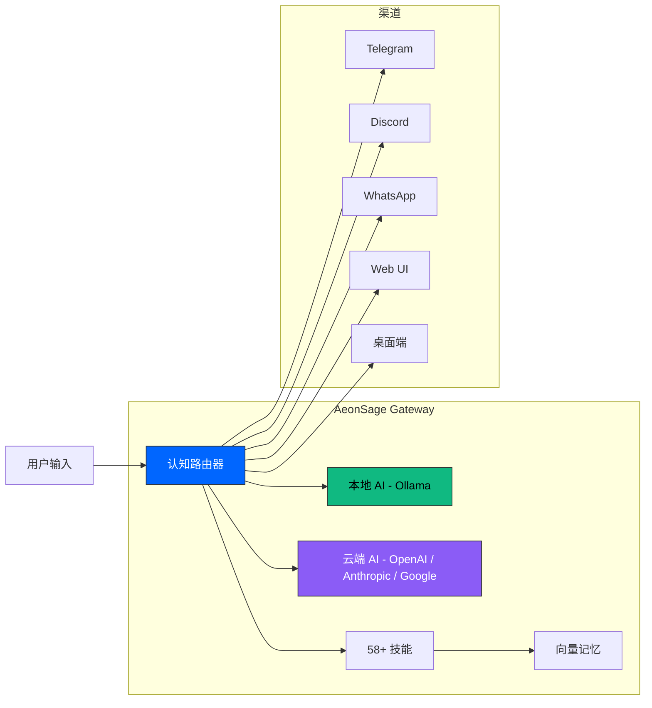

<div align="center">
  <a href="https://aeonsage.org">
    
  </a>

  <br><br>

  **智能。自主。属于你。**<br>
  本地优先隐私保护、多模型智能路由、30+ 渠道集成 — 构建真正属于你的自主 AI Agent。

  <br>

  [](https://github.com/velonone/Aeonsage/releases)
  [](https://github.com/velonone/Aeonsage)
  [](./LICENSE)
  [](https://aeonsage.org/docs)
  [](./README.md)

</div>

---

> **你的 AI，你的硬件，你的规则。**
>
> AeonSage 是一个本地部署的 AI Agent 平台，完全运行在你的设备上。连接任意 AI 模型 — 本地或云端 — 并将自主 Agent 部署到 30+ 渠道。数据永远不会离开你的设备。没有供应商锁定。开源内核 + 可选 Pro 商业版。

---

## 目录

- [为什么选择 AeonSage](#为什么选择-aeonsage)
- [核心优势](#核心优势)
- [系统架构](#系统架构)
- [多平台](#多平台)
- [技能系统](#技能系统)
- [连接矩阵](#连接矩阵)
- [下载与快速开始](#下载与快速开始)
- [版本对比](#版本对比)
- [技术栈](#技术栈)
- [开发者](#开发者)
- [生态合作伙伴](#生态合作伙伴)
- [许可与法律声明](#许可与法律声明)

---

## 为什么选择 AeonSage

大多数 AI 工具依赖云端、绑定单一模型，把你的数据当作他们的产品。AeonSage 采用完全不同的方式：

| | 云端聊天机器人 | AeonSage |
| :--- | :--- | :--- |
| **数据** | 发送到第三方服务器 | 永远不离开你的设备 |
| **模型** | 单一供应商锁定 | 任意模型 — 本地 (Ollama) 或云端 (OpenAI, Anthropic, Google) |
| **渠道** | 单一界面 | 30+ 原生协议桥接 |
| **成本** | 按 Token 计费 | 无限本地推理，BYOK 自带密钥接入云端 |
| **扩展性** | 封闭生态 | 开放技能系统 + MCP 协议支持 |
| **部署** | 仅 SaaS | 自托管，支持离线部署 |

---

## 核心优势

<div align="center">
  <a href="https://github.com/velonone/Opensage">
    
  </a>
</div>

### 认知路由器 — 开源智能模型编排

认知路由器 (Cognitive Router) 是 AeonSage 完全开源的决策引擎 — OSS 开源版和 Pro 版均包含此功能。每个请求都会被分析复杂度、意图类型和领域 — 然后自动路由到最优 AI 模型。不同于闭源的商业路由方案，AeonSage 的认知路由器基于 MIT 许可证开源，完全运行在你自己的硬件上。

> **[Opensage](https://github.com/velonone/Opensage)** — 认知路由器已独立开源。代码极其轻量，可以接入任何场景 — 包括 IDE、CLI 工具、Bot 和自定义应用。欢迎大家提交 PR，一起完善。

**工作原理：**

每个请求都会经过分级复杂度分析流水线。路由器对意图进行分类、评估复杂度，然后自动选择最合适的模型 — 本地或云端 — 无需手动干预。

```
用户请求 → 认知路由器
              ├── L1 (简单)  → 本地模型 (Ollama)
              ├── L2 (中等)  → 高效云端模型
              ├── L3 (复杂)  → 旗舰级模型
              └── 回退       → 自动级联到下一提供商
```

| 能力 | 描述 |
| :--- | :--- |
| **分级复杂度分析** | 每个请求按意图类型、领域和复杂度评分。路由器自动为任务匹配最合适的模型。 |
| **自动提供商回退** | 当某个模型或提供商不可用时，路由器自动级联到下一个可用选项。无需手动切换。 |
| **语义记忆** | 前序对话的上下文会影响路由决策。路由器会随着使用逐渐学习哪些模型最适合你的场景。 |
| **BYOK 支持** | 自带任意云端提供商的 API 密钥。使用你已有的密钥，配合 AeonSage 的智能路由层。 |
| **本地优先策略** | 当任务可以在本地处理时，路由器优先选择本地模型 — 数据留在你的设备上，减少外部 API 调用。 |

### MCP 工具 — 模型上下文协议 

AeonSage 同时实现了 **MCP (Model Context Protocol)** 的客户端和服务端，让你的 Agent 能够连接到任何 MCP 兼容的工具生态。此功能目前处于**测试阶段** — API 接口可能会随 MCP 规范的演进而调整。

**作为 MCP 客户端** — 你的 Agent 可以使用外部 MCP 服务器作为工具：
- 文件系统、数据库、API、Web 浏览器
- 生态系统中的任何第三方 MCP 服务器
- 自动工具发现和能力协商

**作为 MCP 服务端** — 将 AeonSage 的 107 个 RPC 方法暴露给外部 MCP 客户端：
- 其他 AI Agent 可以将你的 AeonSage 实例作为工具调用
- IDE 集成（VS Code、Cursor）可以与你的 Agent 交互
- 串联多个 AeonSage 实例，实现分布式 AI 工作流

```typescript
// 示例：在技能中使用外部 MCP 工具
import { defineSkill } from "@aeonsage/sdk";

export default defineSkill({
  name: "research-assistant",
  tools: ["mcp://filesystem", "mcp://web-browser", "mcp://database"],
  async execute(ctx) {
    // Agent 自动发现并使用可用的 MCP 工具
    const files = await ctx.mcp.call("filesystem", "list", { path: "./docs" });
    const summary = await ctx.llm.chat(`总结以下内容：${files}`);
    return summary;
  },
});
```

### 多 Agent 协调

生成专业化的工作 Agent 进行并行任务执行。每个 Agent 拥有独立的上下文、记忆和工具访问权限。

- **管理者模式** — 一个编排 Agent 将子任务委派给 Worker
- **并行执行** — 多个 Agent 同时处理不同方面的工作
- **共享记忆** — Agent 之间可以读取共享的向量记忆空间
- **任务交接** — Agent 之间无缝传递上下文

---

## 系统架构

AeonSage 采用**六层内核环 (Kernel-Ring) 架构**，包含 58+ 模块和 107 个 WebSocket RPC 方法。

```
                         AeonSage Gateway
  ┌──────────┬──────────┬──────────┬──────────┬─────────────┐
  │  Ring 0  │  Ring 1  │  Ring 2  │  Ring 3  │   Ring 4    │
  │  内核层  │  路由层  │  技能层  │  通道层  │   界面层    │
  ├──────────┼──────────┼──────────┼──────────┼─────────────┤
  │ 主权身份 │ 多模型   │ 58+ 模块 │ 30+ 平台 │ Cockpit UI  │
  │ 状态机   │ 分级路由 │ MCP SDK  │ 协议桥接 │ 桌面客户端  │
  │ 安全防御 │ 故障回退 │ 插件系统 │ 原生协议 │ WebSocket   │
  └──────────┴──────────┴──────────┴──────────┴─────────────┘
                     107 个 RPC 方法
```

### 层级详情

| 层级 | 组件 | 功能描述 |
| :--- | :--- | :--- |
| **Ring 0 — 内核** | 主权内核 | 确定性状态机管理 Agent 生命周期、VDID 身份验证、主动防御墙、不可篡改的审计日志。每个用户意图都被视为一笔可验证的交易。 |
| **Ring 1 — 路由** | 认知路由器 | 多模型编排与分级复杂度分析。将每个请求路由到最优模型（本地 Ollama、OpenAI、Anthropic、Google 等），支持自动提供商级联回退和语义记忆。按需匹配模型能力与任务复杂度，大幅节省 Token 消耗。 |
| **Ring 2 — 技能** | 技能扩展 | 58+ 内置模块，覆盖浏览器自动化、语音唤醒、DeFi 监控、定时任务、向量记忆、多 Agent 协调。通过 MCP 协议和插件 SDK 扩展。 |
| **Ring 3 — 通道** | 通道桥接 | 30+ 原生协议桥接。WhatsApp、Telegram、Discord、Slack、Signal、Email、LINE、Matrix、微信等。每个桥接实现原生协议 — 无需第三方自动化中间件。 |
| **Ring 4 — 界面** | 界面层 | Lit 3.3 Cockpit 控制台用于实时监控，Tauri v2 桌面客户端用于日常使用，107 个 WebSocket RPC 方法用于编程访问。 |

### 工作原理



---

## 多平台

### 三端合一体验

AeonSage 将**网站 + 桌面端 + 渠道**统一为一体化无缝体验。在官网注册、下载桌面应用，即可完成所有本地部署功能 — 一个 Gateway 实例驱动全部平台，上下文跨端持续连贯。

```
  ┌─────────────┐     ┌──────────────┐     ┌──────────────┐
  │    官网     │     │   桌面端     │     │    渠道      │
  │  注册登录   │ ──→ │  本地下载    │ ──→ │  30+ 桥接   │
  │  仪表盘     │     │  本地 AI     │     │  零配置      │
  └─────────────┘     └──────────────┘     └──────────────┘
         │                    │                     │
         └────────────────────┼─────────────────────┘
                              │
                    ┌─────────┴─────────┐
                    │  AeonSage Gateway │
                    │  单实例驱动       │
                    │  共享上下文       │
                    └───────────────────┘
```

### 桌面客户端

基于 **Tauri v2** (Rust) + **React 19** 构建 — 原生性能，仅 ~10 MB（Electron 需 ~150 MB）。

- **聊天** — 多 Agent 标签页，每个对话独立上下文
- **工作流** — 可视化拖拽式多 Agent 工作流构建器
- **技能商店** — 一键安装技能，配置和管理
- **设置** — 模型配置、BYOK 密钥管理、主题定制
- **Agent 可视化** — 实时执行流程、工具调用与推理链路
- **跨平台** — Windows、macOS、Linux

### Web 仪表盘

您的指挥中心：`aeonsage.org/dashboard`。Agent 配置、技能市场、数据分析、账单 — 在浏览器中管理一切。

### 渠道

零安装接入点。在 Telegram、Discord、WhatsApp 或 30+ 支持的渠道上直接与你的 Agent 对话。跨设备上下文持续连贯。

---

## 技能系统

浏览 30+ 预置技能或创建您自己的。每个技能为你的 Agent 扩展新能力。

| 技能 | 描述 |
| :--- | :--- |
| **浏览器自动化** | 使用 Playwright 自动化网络研究。Agent 代替你浏览、抓取、汇报。 |
| **语音唤醒** | "嘿 AeonSage" — 通过 TTS/STT 语音实现免提控制。 |
| **DeFi 监控** | 实时追踪链上流向、巨鲸警报和投资组合。 |
| **定时任务** | 安排定期任务 — 晨间简报、日报、价格检查。 |
| **向量记忆** | 向量数据库语义搜索。跨会话持久上下文，永不遗忘。 |
| **多 Agent** | 生成工作 Agent 执行并行任务。用自主 Worker 扩展你的团队。 |
| **MCP 工具** | 模型上下文协议支持。连接外部工具和数据源。AeonSage 同时充当 MCP 客户端和服务端。 |
| **VDID 身份** | 可验证的去中心化身份，带链上声誉评分。 |

> 使用 TypeScript 构建自定义技能并发布到技能市场。完全访问 Gateway 的 107 个 RPC 方法。

---

## 连接矩阵

原生协议级桥接，无需第三方自动化服务。

| 协议 | 实现方式 | 核心能力 | 状态 |
| :--- | :--- | :--- | :---: |
| **Telegram** | MTProto / Bot API | 私密聊天、频道、群组、管理操作、Bot 命令 |  |
| **WhatsApp** | Baileys (wacli) | 多设备登录、媒体收发、语音笔记、群组 |  |
| **Discord** | WebSocket Gateway | 语音频道、Slash 指令、角色、表情反应 |  |
| **Slack** | Enterprise Grid | 线程支持、文件分析、App Home、工作流 |  |
| **Signal** | libsignal | 端到端加密 (E2EE) 通信、群组 |  |
| **Email** | SMTP / IMAP | 邮件解析、草稿撰写、附件、线程 |  |
| **LINE** | Messaging API | Rich Menus、Flex Messages |  |
| **Matrix** | matrix-js-sdk | 联邦协议、E2EE 房间 |  |
| **微信** | itchat / WxPusher | 文本、媒体、小程序 |  |
| **Nostr** | NIP-01 WebSocket | 去中心化中继消息 |  |

> 总计支持 **30+ 渠道**，包括 Mattermost、Google Chat、Twitch、飞书、MS Teams 等。查看[完整列表](https://aeonsage.org/docs)。

---

## 下载与快速开始

### 下载

| 平台 | 下载 | 系统要求 |
| :--- | :--- | :--- |
| **Windows** | [AeonSage-win.exe](https://aeonsage.org/download) | Windows 10+ |
| **macOS** | 即将推出 | macOS 13+，Apple Silicon & Intel |
| **Linux** | [AeonSage-linux.AppImage](https://aeonsage.org/download) | Ubuntu 22+ / Fedora 38+ |

### 便携版 (Windows)

```bash
# 下载并解压
curl -LO https://github.com/velonone/Aeonsage/releases/latest/download/AeonSage_OSS.zip
# 解压后运行 AeonSage.bat
```

### 开发者安装

```bash
# 克隆仓库
git clone https://github.com/velonone/Aeonsage.git
cd Aeonsage

# 安装依赖（需要 pnpm）
pnpm install

# 初始化配置
pnpm run init

# 启动网关
pnpm start
```

控制台 UI 将在 `http://localhost:18789` 可用。

### 搭配 Ollama（本地 AI）

```bash
# 安装 Ollama (https://ollama.com)
ollama pull llama3.1

# 启动 AeonSage，自动检测 Ollama
pnpm start
# AeonSage 将自动检测并连接到本地 Ollama 实例
```

### Docker

```bash
docker compose -f docker-compose.prod.yml up -d
```

---

## 版本对比

AeonSage 采用 **OSS 开源 + Pro 商用** 双轨模式。开源版功能完整，Pro 版解锁云端能力。

| | 免费版 (OSS 开源) | 专业版 (Pro 商用) | 企业版 |
| :--- | :---: | :---: | :---: |
| **价格** | $0 | $59/月 | 定制 |
| **模式** | 完全开源 (MIT) | 商业授权 | 商业授权 |
| **部署** | 本地自托管 | 本地 + 云端 | 私有云 / 本地部署 |
| **目标用户** | 开发者、自托管用户 | 高级用户、创作者 | 团队、企业、行业定制 |
| **本地 AI (Ollama)** |  |  |  |
| **认知路由器** |  |  |  |
| **全部 30+ 渠道** |  |  |  |
| **MCP 工具（客户端 + 服务端）** |  |  |  |
| **BYOK（自带密钥）** |  |  |  |
| **语音唤醒 + TTS** |  |  |  |
| **浏览器自动化** |  |  |  |
| **社区技能** |  |  |  |
| **桌面客户端** |  |  |  |
| **云端 AI（无限）** |  |  |  |
| **Telegram Bot 远程** |  |  |  |
| **CloudRelay** |  |  |  |
| **Finance + DeFi 交易** |  |  |  |
| **VDID 链上身份** |  |  |  |
| **高级 AI 模型** |  |  |  |
| **Pro 主题 + Worker** |  |  |  |
| **私有云部署** |  |  |  |
| **团队管理 + API** |  |  |  |
| **行业定制** |  |  |  |
| **SOC2、SAML/SCIM、审计** |  |  |  |

> **免费版对本地 AI 完全可用。** 无限 Ollama 推理、全部 30+ 渠道、**开源认知路由器**（智能模型编排）、MCP 工具（客户端 + 服务端）、BYOK 云端接入、语音唤醒、浏览器自动化、社区技能 — 全部 $0。Pro 版解锁无限云端 AI、Telegram Bot 远程控制、Finance 面板和高级模型。**企业版是最高版本** — 针对不同行业垂直领域（金融、医疗、法律等）的定制部署，附带专属技术支持、合规审计和团队管理。

---

## 技术栈

| 组件 | 技术 | 用途 |
| :--- | :--- | :--- |
| **运行时** | Node.js 22+ (ESM) | Gateway 服务器与技能执行 |
| **语言** | TypeScript 5.x | 端到端类型安全 |
| **后端** | Hono + Express + WebSocket | HTTP API、静态服务、实时 RPC |
| **控制台 UI** | Lit 3.3 + Vite 7 | Web 端监控与控制面板 |
| **桌面客户端** | Tauri v2 (Rust) + React 19 | 原生桌面客户端 (~10 MB) |
| **网站** | React 19 + Vite | 官网与文档 |
| **认证** | 社交登录 (Telegram / Google / GitHub) | 分阶段：匿名 → 社交登录 → 钱包 |
| **数据库** | PostgreSQL + SQLite (本地) | 云端持久化 + 本地状态 |
| **本地 AI** | Ollama | 本地模型推理 (Llama, Mistral 等) |
| **云端 AI** | OpenRouter, Anthropic, OpenAI, Google | 云端模型访问，支持 BYOK |
| **MCP** | Model Context Protocol | 客户端 + 服务端，外部工具集成 |
| **身份** | VDID Network | 可验证的去中心化身份 (Pro) |

---

## 开发者

### OpenAI 兼容 API

AeonSage 提供 OpenAI 兼容的 HTTP API。使用任何 OpenAI 客户端库连接本地实例：

```bash
curl http://localhost:18789/v1/chat/completions \
  -H "Content-Type: application/json" \
  -d '{
    "model": "llama3.1",
    "messages": [{"role": "user", "content": "你好"}]
  }'
```

### 构建技能

技能是 TypeScript 模块，扩展 Agent 能力。完全访问 Gateway 的 107 个 RPC 方法：

```typescript
import { defineSkill } from "@aeonsage/sdk";

export default defineSkill({
  name: "my-skill",
  description: "自定义技能",
  async execute(ctx) {
    const result = await ctx.llm.chat("总结这份文档");
    return result;
  },
});
```

### MCP 集成

AeonSage 实现了完整的 MCP 规范。连接外部工具作为 MCP 服务器，或将你的 AeonSage 实例作为 MCP 服务端暴露给其他客户端：

```typescript
// 注册外部 MCP 服务器
await gateway.mcp.register({
  name: "my-database",
  transport: "stdio",
  command: "npx",
  args: ["-y", "@modelcontextprotocol/server-sqlite", "data.db"],
});

// 现在 Agent 可以将数据库作为工具使用
const result = await agent.chat("展示数据库中的所有用户");
```

### WebSocket RPC

107 个方法用于编程控制：

```typescript
const ws = new WebSocket("ws://localhost:18789/ws");
ws.send(JSON.stringify({
  method: "agent.send",
  params: { channel: "telegram", message: "来自 API 的消息" }
}));
```

> 完整 API 文档请访问 [aeonsage.org/docs](https://aeonsage.org/docs)。

---

## 生态合作伙伴

<table>
  <tr>
    <td align="center" width="33%">
      <a href="https://github.com/velonone/Opensage"></a><br>
      <br><b>认知路由</b><br>Opensage — 开源智能模型编排引擎
    </td>
    <td align="center" width="33%">
      <a href="https://vdid.org"></a><br>
      <br><b>身份层</b><br>VDID Network — 可验证的去中心化身份
    </td>
    <td align="center" width="33%">
      <a href="https://velonlabs.com"></a><br>
      <br><b>研究与工程</b><br>VelonLabs — Velon 生态系统
    </td>
  </tr>
</table>

---

## 许可与法律声明

**AeonSage 社区版**采用 **MIT 许可证**分发，附带商标条款。

- **源代码** — MIT 许可证。自由 Fork、修改和自托管。
- **品牌资产** — "AeonSage" 名称、Logo 以及 "VDID" 验证网络是 VelonLabs 的专有资产。利用 AeonSage 品牌的商业衍生行为需获得明确的企业授权。
- **开源内核。自托管或云端。隐私优先。**

---

<div align="center">

  

  <br><br>

  **由 [VelonLabs](https://velonlabs.com) 与 AeonSage 核心团队精心打造**

  <br>

  [](https://aeonsage.org)
  [](https://aeonsage.org/download)
  [](https://aeonsage.org/docs)
  [](https://t.me/aeonsage)
  [](https://x.com/AeonSage)

  <br>

  <sub>Copyright &copy; 2025-2026 VelonLabs. All rights reserved.</sub>

</div>
