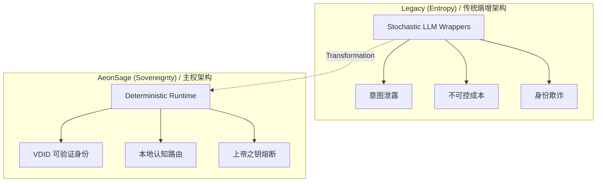
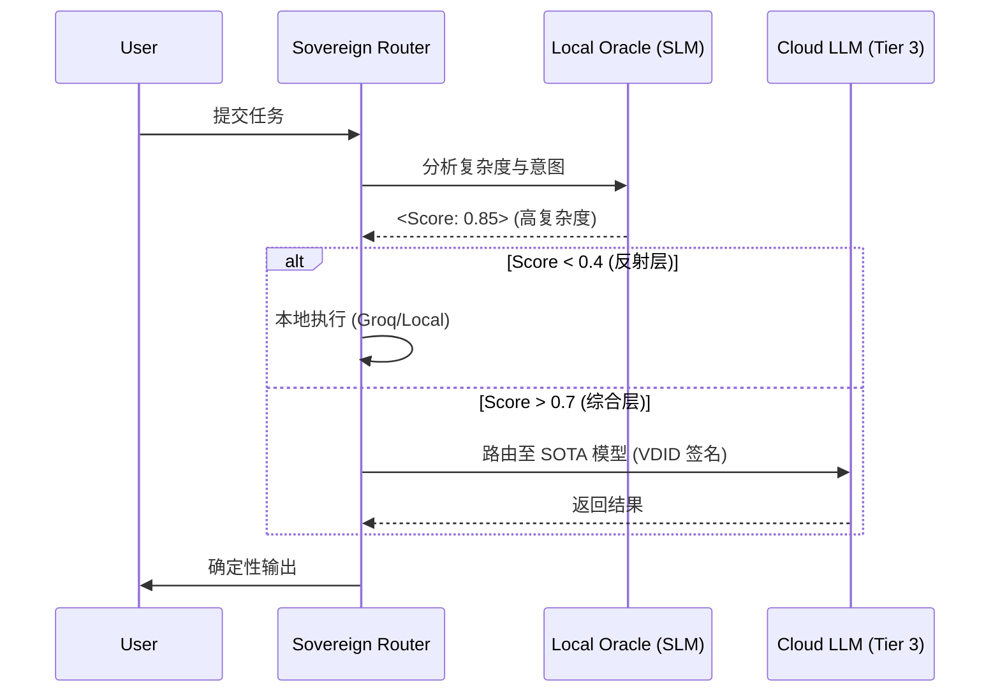
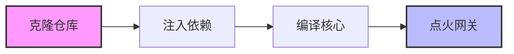

<div align="center">


**The Deterministic Foundation for Autonomous Agency**

**VelonLabs + @Aeonsage 联合发布**

<p>
  <a href="https://aeonsage.org">官方网站</a> •
  <a href="https://docs.aeonsage.org">技术文档</a> •
  <a href="https://pro.aeonsage.org">企业方案</a>
</p>

<p align="center">
  <a href="https://github.com/velonone/AeonsagePro/releases/download/v2026.1.27/AeonSage-2026.1.27.dmg">
    
  </a>
  <a href="https://github.com/velonone/AeonsagePro/releases/download/v2026.1.27/AeonSage-Setup-2026.1.27.exe">
    
  </a>
</p>

[](./LICENSE)
[](./docs/security.md)

</div>


---

## 1. 主权宣言 (The Sovereign Thesis)

**AeonSage** 是为了解决自主 Agent **熵增难题** 而设计的 **Layer-2 认知编织层 (Cognitive Fabric)**。区别于随机性的聊天机器人框架，AeonSage 提供了一个基于 **身份 (Identity)**、**安全 (Security)** 和 **经济 (Economics)** 三大公理的 **确定性运行时环境 (Deterministic Runtime)**。



---

## 2. 架构规范 (Architectural Specifications)

### 2.1 认知内核 (OpenSage Kernel)

**主权认知路由** 是一个本地优先的决策引擎。它在本地评估任务的复杂度与意图，杜绝了向云端泄露敏感的推理过程。



### 2.2 多层防御体系 (Defense-in-Depth)

| 组件 | 机制 | 目标 |
| :--- | :--- | :--- |
| **上帝之钥 (The God Key)** | WebSocket 熔断开关 | < 50ms 全局进程终止 |
| **VDID** | `did:vdid` 加密签名 | 不可抵赖性与取证审计 |
| **物理隔离主权** | 本地向量库 (ChromaDB) | 零遥测 (Zero-Telemetry) 运行 |

---

## 3. 认知经济学 (Cognitive Economics)

**乐观级联逻辑 (Optimistic Cascading Logic)** 通过将任务路由至最优层级，显著降低了运营成本。

| 认知层级 | 模型类别 | 成本基准 | 流量目标 |
| :--- | :--- | :--- | :--- |
| **Tier 1 (反射层)** | Local SLM / Groq | **~$0.05 / 1M** | 60% 流量 |
| **Tier 2 (推理层)** | GPT-4o-mini | ~$0.15 / 1M | 30% 流量 |
| **Tier 3 (综合层)** | Claude 3.5 / o1 | ~$15.00 / 1M | 10% 流量 |

---

## 4. 集成标准 (The Nervous System)

**通道抽象层 (Channel Abstraction Layer)** 为异构网络提供了统一的状态管理接口。

| 网络协议 | 集成方法 | 安全上下文 |
| :--- | :--- | :--- |
| **Telegram** | MTProto Wrapper | VDID 签名载荷 |
| **Discord** | OAuth2 Gateway | 基于角色的访问控制 (RBAC) |
| **WhatsApp** | Baileys (WebSocket) | 保留端到端加密 |
| **Signal** | Libsignal Client | 仅本地解密 |
| **Terminal** | TUI Dashboard | Root / Sudo 上下文 |

---

## 5. 部署协议 (Deployment Protocol)

### 初始化序列



```bash
# 1. 克隆主权仓库
git clone https://github.com/velonone/AeonsagePro.git

# 2. 注入依赖
corepack enable && pnpm install

# 3. 编译核心
pnpm build

# 4. 点火网关
pnpm aeonsage gateway
```

---

## 6. 战略生态 (Strategic Ecosystem)

AeonSage 是高完整性主权技术的融合。

<table align="center" border="0" cellpadding="10">
  <tr>
    <td align="center" width="33%">
      <a href="https://vdid.io">
        
      </a>
      <br><br>
      <strong>Identity Layer</strong>
      <br>
      <sub>Verifiable Decentralized ID</sub>
    </td>
    <td align="center" width="33%">
      <a href="https://github.com/velonone/Opensage">
        
      </a>
      <br><br>
      <strong>认知内核 (Kernel)</strong>
      <br>
      <sub>Local-First Reasoning Router</sub>
    </td>
    <td align="center" width="33%">
      <a href="https://velonlabs.com">
        
      </a>
      <br><br>
      <strong>Research Lab</strong>
      <br>
      <sub>Sovereign Architecture</sub>
    </td>
  </tr>
</table>

---

<div align="center">
  <sub><strong>EST. 2025 · AEONSAGE COLLECTIVE · MIT LICENSE</strong></sub>
</div>
