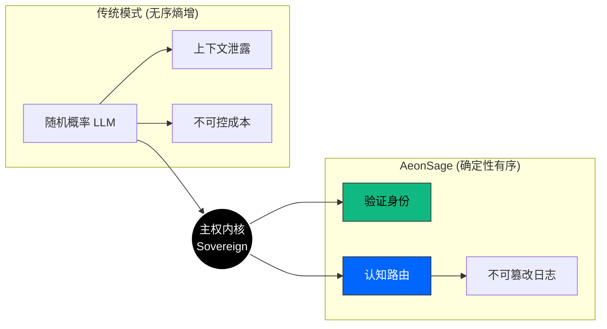

<div align="center">
  <a href="https://aeonsage.org">
    
  </a>
  <br>
  
  [](https://github.com/velonone/Aeonsage/releases)
  [](https://github.com/velonone/Aeonsage)
  [](./LICENSE)
  [](https://docs.aeonsage.org)

  <br>
  <p style="font-size: 1.1em; max-width: 800px; margin: auto; padding-top: 20px; color: #666;">
    <b>确定性 · 主权级 · 智能操作系统</b><br>
    开启主权之旅: <a href="https://aeonsage.org">官方网站</a> • <a href="https://pro.aeonsage.org">企业版</a>
  </p>
</div>

<hr style="border: 0; outline: none; height: 1px; background: linear-gradient(to right, transparent, #30363d, transparent); margin: 40px 0;">

## 主权宣言 (The Sovereign Manifesto)

> **"身份先行，智能次之，工具为末。"**

在当前的 AI 浪潮中，**身份 (Identity)** 往往被视为事后补救的附庸。大模型不仅存在幻觉，更缺乏对上下文的严密保护，导致在执行关键任务时缺乏可归因性（Accountability）。

**AeonSage** 彻底逆转了这一范式。它是一个**操作系统**，将 **VDID (主权身份)** 确立为内核级的原语。在任何认知路由发生之前，系统会首先通过不可篡改的账本验证请求的来源、意图与权限。

它不仅仅是一个聊天机器人，它是一个为**经认证的自主智能体**打造的**确定性运行时环境**。

---

## 核心架构设计
AeonSage 采用严格的 **内核环 (Kernel-Ring) 架构**，强制实现认知核心与外部 I/O 的安全隔离。

### 2.1 主权转换 (Sovereign Transformation)
<p align="center">
  <a href="https://github.com/velonone/Aeonsage">
    
  </a>
</p>
AeonSage 作为一个**确定性运行时 (Deterministic Runtime)**，将原始大模型的无序熵转化为有序的主权智能。



### 2.2 认知执行时序 (Execution Sequence)
每一个用户意图都被视为一笔可验证的“认知交易”。

```mermaid
sequenceDiagram
    participant User as 用户
    participant Kernel as 主权内核
    participant Router as 认知路由
    participant Skill as 技能库 (Ring 2)
    participant Ledger as 审计日志

    User->>Kernel: 提交意图 (VDID签名)
    Kernel->>Kernel: 验证签名合法性
    Kernel->>Router: 分发上下文
    
    rect rgb(20, 20, 20)
        Note over Router: 复杂度分析阶段
        Router->>Router: 评估熵值 (0.0 - 1.0)
        
        alt 低复杂度 (<0.3)
            Router->>Skill: 执行本地启发式逻辑
        else 高复杂度 (>0.7)
            Router->>Skill: 调用 SOTA 模型 (Claude/GPT-4)
        end
    end

    Skill-->>Router: 返回执行载荷
    Router->>Ledger: 提交交易哈希
    Router-->>User: 返回确定性响应
```



---

## 4. 连接矩阵 (Connectivity Matrix)

操作系统提供原生协议级桥接，无需依赖第三方自动化服务（如 Zapier）。

| 协议 / 平台 | 实现方式 | 核心能力 | 状态 |
| :--- | :--- | :--- | :---: |
| **WhatsApp** | `wacli` (Baileys) | 多设备登录、媒体收发、语音笔记 | ✅ |
| **Telegram** | `MTProto` / Bot API | 私密聊天、频道管理、群组管理 | ✅ |
| **Discord** | WebSocket Gateway | 语音频道推流、Slash 指令、角色映射 | ✅ |
| **Slack** | Enterprise Grid | 线程支持、文件分析、App Home | ✅ |
| **Signal** | `libsignal` | 端到端加密 (E2EE) 通信 | ✅ |
| **Email** | SMTP / IMAP | 邮件解析、草稿撰写、附件处理 | ✅ |

---

## 5. 部署指南

### 系统要求
*   **OS**: Windows 11 / macOS 13+ / Linux Kernel 5.15+
*   **运行时**: Node.js v22.0.0+ (Active LTS)

### 快速启动 (便携版)
对于 Windows 用户，我们提供零依赖的绿色版。
1.  下载 **[AeonSage_OSS.zip](https://github.com/velonone/Aeonsage/releases/latest/download/AeonSage_OSS.zip)**。
2.  解压压缩包。
3.  运行 `AeonSage.bat`。

### 开发者安装
```bash
# 通过 NPM 全局安装
npm install -g aeonsage

# 初始化配置向导
aeonsage init

# 启动内核
aeonsage start
```

---

## 6. 官方资源

文档结构面向系统运维人员与内核开发者设计。

*   [**安装指南**](./docs/install.md)
*   [**安全策略**](./docs/security.md)
*   [**内核参考手册**](./docs/sovereign-kernel.md)
*   [**插件开发指南**](./docs/plugin.md)

---

## 7. 生态合作伙伴

我们与行业领导者共同定义主权智能的新标准。

<table>
  <tr>
    <td align="center" width="33%">
      <a href="https://vdid.org"></a><br>
      <br><b>身份层</b><br>(VDID Network)
    </td>
    <td align="center" width="33%">
      <a href="https://github.com/velonone/Aeonsage"></a><br>
      <br><b>认知内核</b><br>(Aeonsage Core)
    </td>
    <td align="center" width="33%">
      <a href="https://velonlabs.com"></a><br>
      <br><b>研究与工程</b><br>(VelonLabs)
    </td>
  </tr>
</table>

---

## 许可与法律声明

**AeonSage 社区版 (Community Edition)** 采用 **MIT 许可证** 分发。

> **仅限非商业用途 (Non-Commercial Use Only)**: 尽管源代码是开源的，但 "AeonSage" 商标及 "VDID" 验证网络属于 VelonLabs 的专有技术。任何利用 AEONSAGE 品牌进行的商业衍生行为均需获得明确的企业授权。

<div align="center">
  <br>
  <b>Engineered with Precision by</b><br>
  <h3>VelonLabs & The AeonSage Core Team</h3>
  <br>
  
</div>
