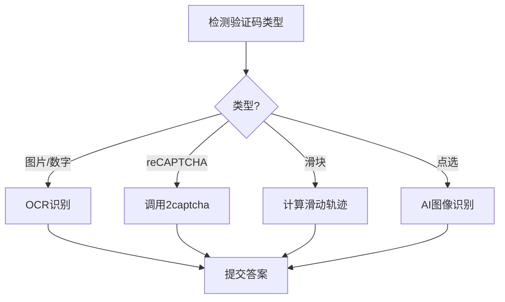

# Human Emulation Skill

人类行为仿真技能 - 让 AeonSage 的自动化操作看起来像真人。

## 可用工具

### 1. human_browser - 隐身浏览器
```
action: "launch" | "navigate" | "close"
url: string (导航目标)
headless: boolean (是否无头模式)
```

**功能：**
- ✅ 绕过 Cloudflare 检测
- ✅ 绕过 reCAPTCHA
- ✅ 随机 User-Agent
- ✅ 隐藏自动化指纹

### 2. human_mouse - 人类化鼠标
```
action: "move" | "click" | "scroll"
x, y: number (坐标)
scrollY: number (滚动量)
button: "left" | "right" | "middle"
```

**功能：**
- ✅ 贝塞尔曲线轨迹（不走直线）
- ✅ 菲茨定律计时
- ✅ 随机微停顿
- ✅ 微抖动模拟

### 3. human_typing - 自然打字
```
action: "type" | "analyze"
text: string (要输入的文字)
wpm: number (每分钟字数，默认60)
enableTypos: boolean (启用打错字)
fatigueEnabled: boolean (启用疲劳模拟)
```

**功能：**
- ✅ 可变按键延迟
- ✅ 偶尔打错字并纠正
- ✅ 思考停顿
- ✅ 疲劳模拟（越打越慢）

## 使用策略

### 绕过机器人检测
1. 启动隐身浏览器
2. 使用曲线鼠标移动
3. 用自然打字输入
4. 添加随机等待时间

### 最佳实践
- 不要移动太快（人类有反应时间）
- 偶尔停顿（模拟思考）
- 滚动要分步（不要一次到底）
- 点击前先悬停

## 示例用法

```typescript
// 1. 启动隐身浏览器
await humanBrowser({ action: "launch" });

// 2. 导航到目标
await humanBrowser({ action: "navigate", url: "https://example.com" });

// 3. 移动鼠标到输入框
await humanMouse({ action: "move", x: 500, y: 300 });

// 4. 点击
await humanMouse({ action: "click" });

// 5. 打字
await humanTyping({ action: "type", text: "Hello World", wpm: 50 });
```

### 4. captcha_solver - 验证码破解
```
action: "solve" | "balance" | "report"
captchaType: 验证码类型
provider: 服务商 (2captcha, capsolver等)
siteKey: 站点密钥
pageUrl: 页面地址
```

**支持的验证码类型：**
| 类型 | 说明 |
|------|------|
| `recaptcha_v2` | Google reCAPTCHA v2（勾选框） |
| `recaptcha_v3` | Google reCAPTCHA v3（隐形） |
| `hcaptcha` | hCaptcha 验证 |
| `turnstile` | Cloudflare Turnstile |
| `funcaptcha` | Arkose Labs FunCaptcha |
| `image` | 传统图片验证码 |
| `slider` | 滑块验证（滑动拼图） |
| `click` | 点选验证（点击指定物品） |
| `audio` | 语音验证码 |
| `math` | 数学计算题 (如 3+5=?) |
| `text` | 数字/字母识别 |

**服务商：**
- 2captcha.com - 最便宜
- capsolver.com - 最快
- anticaptcha.com - 稳定

## 检测测试网站

验证反检测效果：
- https://bot.sannysoft.com/
- https://arh.antoinevastel.com/bots/areyouheadless
- https://fingerprintjs.github.io/fingerprintjs/

## 验证码解决流程


